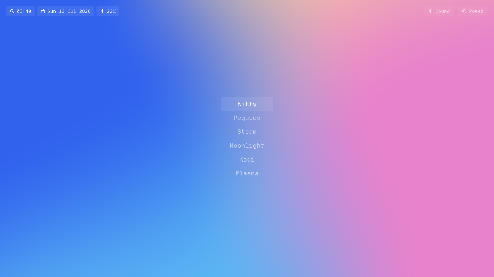

<div align="center">

# launchscope


Launchscope is an app launcher for Linux with a client/server model that takes advantage of [gamescope](https://github.com/ValveSoftware/gamescope)

<br>



<br>

</div>

## What's this?

Think of it as a lightweight display manager tailored for a TV-connected machine. It boots straight into a menu and launches apps — each wrapped in its own gamescope session with per-app resolution, refresh rate, and upscaling settings. When an app exits, the menu comes back. No desktop environment is required, though one can be launched as just another entry (as long as it supports starting from a TTY).

Input can come from anything — TV remote via HDMI-CEC, keyboard, gamepad, or any other HID device. The CEC bridge translates remote button presses into standard uinput keyboard events so the rest of the system sees a plain keyboard.

The Home Assistant integration covers cases where none of those input methods are at hand — launching an app from a phone, a dashboard, or an automation (e.g. turn on the TV and switch to Kodi when a media player starts).

> [!NOTE]
> This project is developed and tested exclusively on NixOS. It may work on other Linux distributions but this is not tested or supported.

## Components

- **[server](server/)** — Go daemon (`launchscoped`) that owns the process slot, manages gamescope-wrapped apps, controls PipeWire audio, and exposes a REST + WebSocket API
- **[ui](ui/)** — LÖVE2D frontend that displays the launcher menu and communicates with the daemon over HTTP
- **[cec](cec/)** — Python bridge that translates HDMI-CEC commands to uinput events, making the TV remote appear as a keyboard
- **[homeassistant](homeassistant/)** — Custom Home Assistant integration for remote control and automation via the daemon API
- **[nix](nix/)** — NixOS and Home Manager modules for declarative deployment

## Architecture

The daemon starts on boot and owns a single process slot — either the UI or one app. The UI connects to the daemon over HTTP to fetch the app list and trigger launches. When an app exits, the daemon restarts the UI automatically.

```
launchscoped (daemon)
├── REST + WebSocket API
├── Process slot (UI or one app, wrapped in gamescope)
├── PipeWire audio control
└── HDMI-CEC via cec-uinput socket

launchscope (UI)
└── Connects to daemon over HTTP

cec-uinput
└── TV remote → uinput keyboard events
```

## Development

```bash
# Enter the dev shell (provides Go, LÖVE2D, and all tools)
nix develop

# Or with direnv
direnv allow
```
