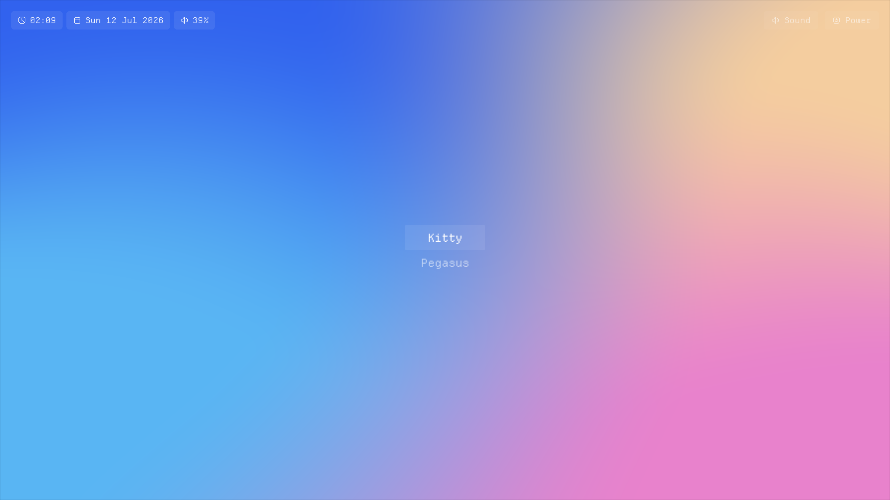
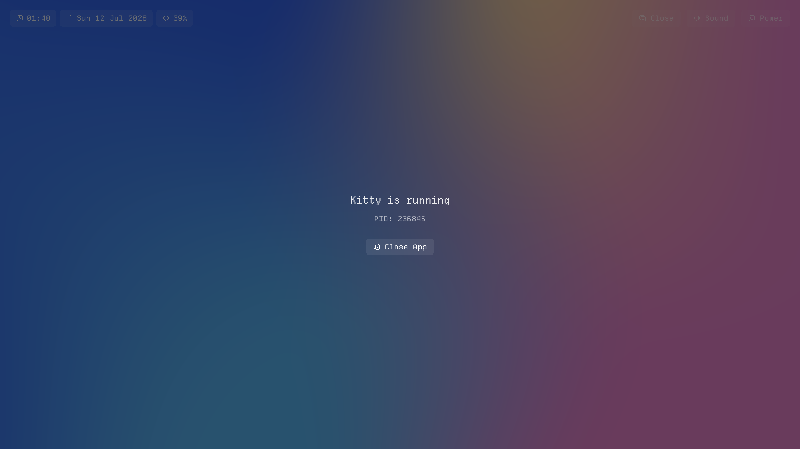
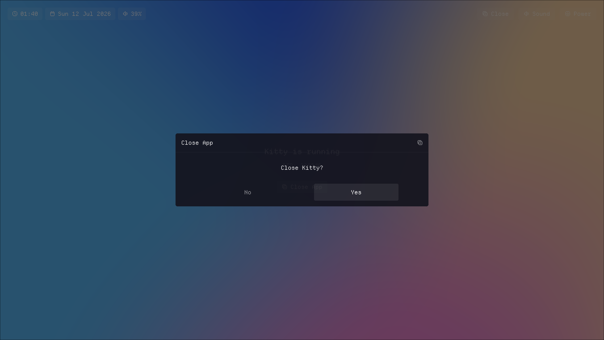
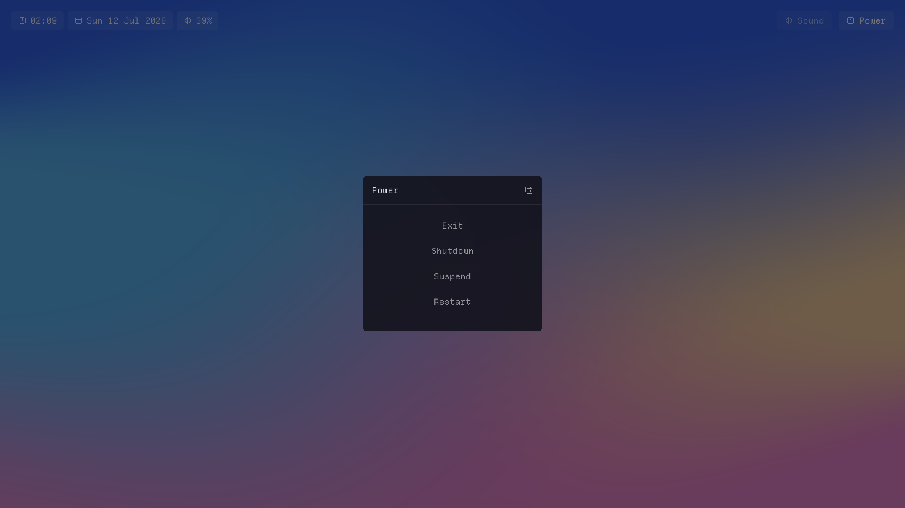
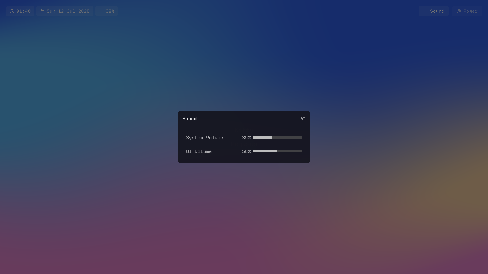

<div align="center">

# launchscope UI


LÖVE2D frontend for the launchscope launcher

<br>

| | |
|:---:|:---:|
|  |  |
|  |  |
|  | |

<br>

</div>

## Overview

The UI displays the launcher menu and handles input from keyboard, gamepad, and TV remote (via CEC). It is configured along three independent axes — session mode, process mode, and display fullscreen — which can be combined freely.

[docs/Modes.md](docs/Modes.md) • [docs/Configuration.md](docs/Configuration.md)

## Environment variables

Set by the shell wrapper or the operator. Override the corresponding config fields.

| Variable | Description |
|---|---|
| `LAUNCHSCOPE_SESSION_MODE` | Override `session_mode` |
| `LAUNCHSCOPE_PROCESS_MODE` | Override `process_mode` |
| `LAUNCHSCOPE_PORT=N` | Override server port (default `8765`) |
| `LAUNCHSCOPE_FONT=name` | Override font |
| `LAUNCHSCOPE_WIDTH=N` | Window width in `nested_*` modes (default `1280`) |
| `LAUNCHSCOPE_HEIGHT=N` | Window height in `nested_*` modes (default `720`) |

## Running

In `daemon` process mode the UI is launched automatically by `launchscoped` — start the daemon instead:

```bash
launchscoped
```

To run the UI directly (for `standalone` process mode or development):

```bash
# nested_direct, standalone — windowed, no daemon
LAUNCHSCOPE_SESSION_MODE=nested_direct LAUNCHSCOPE_PROCESS_MODE=standalone love ui/

# nested_direct, daemon — windowed, for testing against a running launchscoped
LAUNCHSCOPE_SESSION_MODE=nested_direct love ui/
```

In the Nix dev shell:

```bash
ls-ui                # nested_direct session, daemon process mode
ls-ui-gs             # nested_gamescope session, daemon process mode
ls-ui-standalone     # nested_direct session, standalone process mode
ls-ui-standalone-gs  # nested_gamescope session, standalone process mode
```

## Credits

**Font** — [DepartureMono Nerd Font](https://departuremono.com/) by Helena Zhang & Vic Fieger. Default font when using the Nix module. Fonts are not bundled — resolved at runtime via `fc-match`.

**Icons** — [Pixelarticons](https://pixelarticons.com/) by Gerrit Halfmann. MIT License.

**Background shader** — adapted from a [Shadertoy shader](https://www.shadertoy.com/view/wdyczG) by hahnzhu.

**Sound effects** — [Universal UI/Menu Soundpack](https://cyrex-studios.itch.io/universal-ui-soundpack) by Nathan Gibson (Cyrex Studios). CC BY 4.0.
